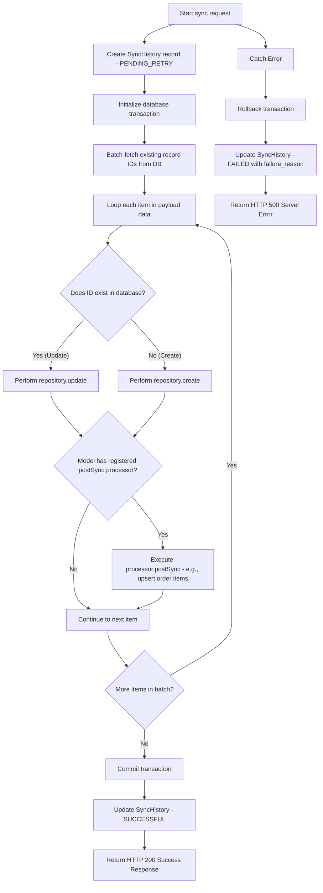

# Sync Bridge Express API

Sync Bridge is a robust, production-ready middleware and data exporter service built with **TypeScript**, **Express.js**, and **GraphQL**. It is designed to act as an ingestion and synchronization bridge, receiving, validating, and persisting data payloads from various upstream systems (such as ERPs, CRMs, or external DBs) and syncing them to a target database.

The application boasts a dual-protocol architecture: a high-throughput **REST API** for structured transactional synchronization and a flexible **GraphQL API** (powered by Apollo Server and TypeGraphQL) with real-time **WebSocket Subscriptions** to stream data changes as they happen.

---

## Table of Contents

- [Architectural Overview](#architectural-overview)
- [Key Features](#key-features)
- [Tech Stack](#tech-stack)
- [Project Directory Structure](#project-directory-structure)
- [Configuration & Environment Variables](#configuration--environment-variables)
- [Database Configuration & Migrations](#database-configuration--migrations)
- [Getting Started](#getting-started)
  - [Prerequisites](#prerequisites)
  - [Installation](#installation)
  - [Running the Application](#running-the-application)
- [REST API Specifications](#rest-api-specifications)
  - [Authentication](#authentication)
  - [Endpoints & Examples](#endpoints--examples)
- [GraphQL API Specifications](#graphql-api-specifications)
  - [GraphQL Endpoints & Queries](#graphql-endpoints--queries)
  - [GraphQL Subscriptions](#graphql-subscriptions)
- [Utility & Automation Scripts](#utility--automation-scripts)
- [Testing & Quality Assurance](#testing--quality-assurance)
- [Docker & Containerization](#docker--container-ization)
- [Production Process Management (PM2)](#production-process-management-pm2)
- [Code Style & Git Hooks](#code-style--git-hooks)

---

## Architectural Overview

Sync Bridge serves as a decoupling layer between core business databases and external synchronizers. When data is received:

1. **Validation & Filtering**: The service applies strict Joi-based validators via `celebrate` (for REST) or class-validators (for GraphQL) to ensure data sanity.
2. **Transaction & Persist**: It logs a comprehensive transaction history record (`SyncHistory`) mapping the payload, target model, and state.
3. **Database Write**: It executes an upsert logic on PostgreSQL/SQLite. If an item exists, it updates it; if not, it creates a new entry.
4. **Relational Upserting**: For complex nested entities (such as an `Order` with multiple `OrderItems`), it processes nested relations transactionally.
5. **Real-time Event Streaming**: Any mutation (e.g., creating an employee) automatically publishes an event to an in-memory PubSub channel, broadcasting updates to active WebSocket subscription clients in real time.

```
                  ┌───────────────────────────────┐
                  │   External Sources / Python   │
                  │   Scripts / ERP Integrations  │
                  └───────────────┬───────────────┘
                                  │
                  ┌───────────────▼───────────────┐
                  │      X-Auth-Token Check       │
                  └───────────────┬───────────────┘
                                  │
                ┌─────────────────┴─────────────────┐
                │                                   │
      ┌─────────▼─────────┐               ┌─────────▼─────────┐
      │     REST API      │               │    GraphQL API    │
      │  (Joi Validation) │               │   (Apollo / WS)   │
      └─────────┬─────────┘               └─────────┬─────────┘
                │                                   │
                └─────────────────┬─────────────────┘
                                  │
                 ┌────────────────▼────────────────┐
                 │       Sync History Logger       │
                 │   (Pending/Failed/Successful)   │
                 └────────────────┬────────────────┘
                                  │
              ┌───────────────────┴───────────────────┐
              │                                       │
      ┌───────▼───────┐                       ┌───────▼───────┐
      │  Main DB (W)  │                       │  Replica (R)  │
      │ sqlite / pg   │                       │ sqlite / pg   │
      └───────────────┘                       └───────────────┘
```

### Data Synchronization Control Flow

The REST synchronization endpoint (`POST /api/v1/sync`) follows a decoupled, highly optimized **Strategy Pattern** to process incoming data batches transactionally:



This decoupled architecture strictly satisfies the **Open-Closed Principle (OCP)**. This means that if a new model requires complex custom relationship syncing (such as child elements, history logs, or custom side-effects), developers can simply register a new `SyncProcessor` in the registry. The core transaction and synchronization engine remains entirely untouched.

---

## Key Features

- **Dual-Protocol Interfaces**: Full-featured RESTful routing side-by-side with a TypeGraphQL Apollo Server endpoint.
- **Granular Payload Validation**: Joi-driven schemas protecting against dirty inputs. It includes custom validators, such as verifying that `order.amount` equals the mathematical sum of the sub-items (`qty * unit_price`).
- **Resilient Sync Histories**: Track, inspect, delete, and manually trigger a `retry` on failed synchronizations.
- **Real-Time Subscriptions**: Built-in support for WebSockets (`graphql-ws`) to subscribe to lifecycle events like `employeeCreated`.
- **Database Dialect Flexibility**: Seamless default support for SQLite (local file database) with zero external setup, plus configuration capacity to scale to enterprise PostgreSQL (including Main-Slave read/write replication).
- **Production Observability**: Built-in Bunyan logging structured outputs, explicit request-ID headers tracing through request logs, and Prom-Client metrics tracking HTTP requests and memory metrics for Prometheus scraper integration.
- **Graceful Shutdown Protocols**: Cleans up active DB pools, HTTP connections, and open WebSocket clients upon receiving termination signals (`SIGINT`, `SIGTERM`).

---

## Tech Stack

- **Runtime**: [Node.js (v20.18.1)](https://nodejs.org/)
- **Language**: [TypeScript](https://www.typescriptlang.org/)
- **Web Framework**: [Express.js](https://expressjs.com/)
- **ORM & Database**: [Sequelize](https://sequelize.org/) + [Sequelize-Typescript](https://github.com/sequelize/sequelize-typescript) (defaults to SQLite; supports Postgres)
- **GraphQL**: [Apollo Server Express](https://www.apollographql.com/docs/apollo-server/integrations/middleware/) & [TypeGraphQL](https://typegraphql.com/)
- **Real-time WebSockets**: [ws](https://github.com/websockets/ws) & [graphql-ws](https://github.com/enisdenjo/graphql-ws)
- **Validation**: [Joi](https://joi.dev/) & [Celebrate](https://github.com/arb/celebrate)
- **Logging & Metrics**: [Bunyan](https://github.com/trentm/node-bunyan) & [Prom-Client](https://github.com/siimon/prom-client)
- **API Documentation**: [Swagger UI Express](https://github.com/scottie1984/swagger-ui-express) & [swagger-jsdoc](https://github.com/Surnet/swagger-jsdoc)
- **Testing**: [Jest](https://jestjs.io/) & [Supertest](https://github.com/ladjs/supertest)

---

## Project Directory Structure

```text
sync-bridge-express/
├── .env.example             # Template for configuration environment variables
├── Dockerfile               # Multi-stage production Docker compilation
├── entrypoint.sh            # Container bootstrap script executing migrations & startup
├── ecosystem.config.js      # PM2 process configuration for production environments
├── package.json             # Core dependencies, dev dependencies, and execution scripts
├── requests.http            # HTTP request testing worksheet (REST & GraphQL)
├── schema.graphql           # Generated TypeGraphQL schema definition
├── swagger.js               # Swagger compilation configuration
├── sync_employees.py        # Python ingestion integration script
├── tsconfig.json            # TypeScript compiler options
├── src/
│   ├── app.ts               # Express application initialization & middleware attachment
│   ├── server.ts            # Server bootstrap, Apollo setup, WebSocket binding & shutdown logic
│   ├── swagger.ts           # Swagger endpoints definitions
│   ├── api/
│   │   └── controllers/     # Controller layer containing route, validation, and business logic
│   │       ├── status/      # Health checks endpoints
│   │       ├── sync/        # Primary transactional sync and statistics logic
│   │       └── sync-history/# Records logging, paging, and synchronization retry actions
│   ├── constants/           # HTTP response codes and global constants
│   ├── databases/           # Sequelize databases setup
│   │   ├── config/          # Sequelize-CLI migration connections JSON
│   │   ├── models/          # Strongly typed models using sequelize-typescript decorators
│   │   ├── sequelize.ts     # Repositories instantiation and client pooling configuration
│   │   ├── sync.ts          # Database schema auto-synchronizer helper
│   │   └── drop.ts          # Safe database schema teardown helper
│   ├── graphql/             # GraphQL resolvers, schemas, and transport servers
│   │   ├── resolvers/       # Business-specific GraphQL Query, Mutation, and Subscriptions
│   │   ├── pubsubInstance.ts# In-memory pub/sub instance
│   │   ├── schema.ts        # Executable GraphQL Schema generator
│   │   ├── server.ts        # Apollo Server Express configuration
│   │   └── ws.ts            # WebSocket connection handler for active subscriptions
│   ├── helpers/             # Custom utility tools (logger, prometheus metrics, custom env validator)
│   ├── middlewares/         # Express middlewares (auth token validation, global error handler, request ID context)
│   └── types/               # Type and Interface declarations (including DTOs)
```

---

## Configuration & Environment Variables

Create a `.env` file at the root of the project. A template of the configuration looks like this:

```ini
# -- App Settings
NODE_ENV=development
APP_PORT=3000
APP_NAME=exporter-middleware

# -- Database Connection (defaults to SQLite with replication)
DATABASE_URI=sqlite:main.sqlite
MID_MAIN_HOST=main.sqlite
MID_SLAVE_ONE=replica.sqlite

# -- Security Authentication Header Key
AUTHORIZATION_KEY=your-secret-auth-key
```

### Configuration Details

| Variable Name       | Required | Default Value         | Description                                                                                                                                  |
| :------------------ | :------- | :-------------------- | :------------------------------------------------------------------------------------------------------------------------------------------- |
| `NODE_ENV`          | Yes      | `development`         | The runtime environment (`development`, `production`, `test`).                                                                               |
| `APP_PORT`          | No       | `4007` (REST)         | The port the application listens to (binds to `APP_PORT` if defined, else `3000` or `4007`).                                                 |
| `APP_NAME`          | No       | `exporter-middleware` | Identifier used in Bunyan logs.                                                                                                              |
| `DATABASE_URI`      | Yes      | `sqlite:main.sqlite`  | Main database connection URI (e.g. `sqlite:main.sqlite` or `postgresql://...`).                                                              |
| `MID_MAIN_HOST`     | Yes      | `main.sqlite`         | Primary write database. For SQLite, it is the primary storage file (e.g. `main.sqlite`). For PostgreSQL, it is the main writable host.       |
| `MID_SLAVE_ONE`     | Yes      | `replica.sqlite`      | Read-only replica database. For SQLite, it is the replica storage file (e.g. `replica.sqlite`). For PostgreSQL, it is the read-replica host. |
| `AUTHORIZATION_KEY` | Yes      | -                     | Secret string checked in the `X-Auth-Token` header for protected endpoints.                                                                  |

---

## Database Configuration & Migrations

Database structures are represented through high-level declarative decorators mapping back to relational tables.

### Available Models

1. **`SyncHistory`** (`sync_history`): Persistent transactions journal. Logs inputs, updates status, tracks error counts, and lists retries.
2. **`Employee`** (`employees`): Custom data schema for personnel including hierarchy details (`managerId`, `managerEmail`).
3. **`Customer`** (`customers`): Basic consumer profiles schema.
4. **`Product`** (`products`): Merchandises catalog schema.
5. **`Order`** (`orders`): Relational order details container.
6. **`OrderItem`** (`order_items`): Connects ordered products to orders.

### Database Operations (npm scripts)

Database synchronizations and migrations can be triggered via terminal scripts:

- **Model Syncing** (drops and recreates/alters tables strictly following Sequelize Typescript Models definition):
  ```bash
  npm run db:sync
  ```
- **Database Teardown** (cleanly drops all registered tables from the schema):
  ```bash
  npm run db:drop
  ```
- **Run Database Migrations** (applies pending files located inside the migrations directory):
  ```bash
  npm run db:migrate
  ```
- **Undo Last Migration**:
  ```bash
  npm run db:migrate:undo
  ```
- **Undo All Migrations**:
  ```bash
  npm run db:migrate:undo:all
  ```
- **Check Migrations Status**:
  ```bash
  npm run db:migrate:status
  ```

---

## Getting Started

### Prerequisites

- **Node.js**: `v20.18.1` or higher is highly recommended (specified in `volta.node`).
- **npm**: Version `10.x` or higher.
- **Database**: None needed (uses local file-based SQLite by default), but supports PostgreSQL if configured.

### Installation

1. Clone the repository:
   ```bash
   git clone https://github.com/gedeoni/sync-bridge.git
   cd sync-bridge/sync-bridge-express
   ```
2. Install npm packages (this automatically triggers Husky hooks preparation):
   ```bash
   npm install
   ```
3. Establish your environment variables:
   ```bash
   cp .env.example .env
   ```
   _Modify `.env` to supply database connections and your custom `AUTHORIZATION_KEY`._

### Running the Application

#### Development Mode (with hot-reload using nodemon)

```bash
npm run dev
```

_The REST API endpoints will be accessible at `http://localhost:3000/api/v1`._
_The interactive GraphQL Playground (Apollo Sandbox) is served at `http://localhost:3000/graphql`._
_API Swagger Documentation is compiled at `http://localhost:3000/api-docs`._

#### Production Build & Start

```bash
npm run build
npm start
```

---

## REST API Specifications

### Authentication

All protected routes require an authorization token provided in the HTTP request headers. Failure to do so yields an `HTTP 401 Unauthorized` response.

```http
X-Auth-Token: <your-configured-authorization-key>
```

---

### Endpoints & Examples

#### 1. System Health Check

Check connection states and service availability. (Unprotected)

- **URL**: `/api/v1/healthz`
- **Method**: `GET`
- **Response Example (`200 OK`)**:
  ```json
  {
    "status": 200,
    "message": "Express-Typescript Server is Healthy!"
  }
  ```

---

#### 2. Execute Data Synchronization

Syncs structural records (customers, products, orders, employees) to the relational database. If the `id` of an object is supplied and matches an existing record, a partial update (upsert) is made. Otherwise, a new record is created.

- **URL**: `/api/v1/sync`
- **Method**: `POST`
- **Headers**:
  - `Content-Type: application/json`
  - `X-Auth-Token: your-secret-auth-key`
- **Request Schema Constraints (Joi Rules)**:
  - **Model Options**: Must be one of `customers`, `products`, `orders`, `employees`.
  - **Custom Rules for Orders**: If `items` are supplied inside an order payload, the total `amount` field in the parent payload **must exactly equal** the sum of its items' mathematical sum (`unit_price * qty`). An mismatch will return an `HTTP 400 Bad Request` schema validation error.

##### Example Request: Model "customers"

```json
{
  "model": "customers",
  "data": [
    {
      "id": 101,
      "email": "customer.one@example.com",
      "first_name": "Alice",
      "last_name": "Smith",
      "default_currency": "USD"
    }
  ]
}
```

##### Example Request: Model "orders" (with custom amount validation verification)

```json
{
  "model": "orders",
  "data": [
    {
      "order_number": "ORD-2026-0001",
      "customer_id": 101,
      "status": "paid",
      "currency": "USD",
      "amount": 250.0,
      "items": [
        {
          "product_id": 5,
          "qty": 2,
          "unit_price": 100.0
        },
        {
          "product_id": 12,
          "qty": 1,
          "unit_price": 50.0
        }
      ]
    }
  ]
}
```

- **Response Example (`200 OK`)**:
  ```json
  {
    "status": 200,
    "message": "Sync successful",
    "data": {
      "results": [{ "id": 101, "status": "updated" }]
    }
  }
  ```

---

#### 3. Fetch Sync Statistics

Returns a consolidated group status count breakdown of all sync requests tracked.

- **URL**: `/api/v1/sync/stats`
- **Method**: `GET`
- **Headers**: `X-Auth-Token: your-secret-auth-key`
- **Response Example (`200 OK`)**:
  ```json
  {
    "status": 200,
    "message": "Sync stats retrieved successfully",
    "data": {
      "successful": 482,
      "failed": 12,
      "invalid": 3,
      "pending_retry": 0,
      "total": 497
    }
  }
  ```

---

#### 4. Query All Sync History Records

Queries historical synchronization payloads, showing creation logs, status filters, and failure causes. Supports cursor pagination.

- **URL**: `/api/v1/sync-history`
- **Method**: `GET`
- **Headers**: `X-Auth-Token: your-secret-auth-key`
- **Query Parameters**:
  - `page` (optional, default `1`): The page index.
  - `size` (optional, default `10`): Number of logs per page.
  - `status` (optional): Filter logs by `successful`, `failed`, `invalid`, or `pending_retry`.
- **Response Example (`200 OK`)**:
  ```json
  {
    "status": 200,
    "message": "Sync histories retrieved successfully",
    "data": {
      "count": 1,
      "rows": [
        {
          "id": 140,
          "payload": {
            "model": "customers",
            "data": [{ "email": "test@example.com" }]
          },
          "status": "successful",
          "failure_reason": null,
          "retries": 0,
          "created_at": "2026-05-28T10:14:22.000Z",
          "updated_at": "2026-05-28T10:14:22.000Z"
        }
      ]
    }
  }
  ```

---

#### 5. Fetch a Single Sync History Details

- **URL**: `/api/v1/sync-history/:id`
- **Method**: `GET`
- **Headers**: `X-Auth-Token: your-secret-auth-key`
- **Response Example (`200 OK`)**:
  ```json
  {
    "status": 200,
    "message": "Sync history retrieved successfully",
    "data": {
      "id": 42,
      "payload": { ... },
      "status": "failed",
      "failure_reason": "Foreign key constraint violation on product_id",
      "retries": 1,
      "created_at": "2026-05-28T09:00:00.000Z"
    }
  }
  ```

---

#### 6. Retry a Failed Sync

Sets a failed log's status back to `pending_retry` to schedule a re-attempt.

- **URL**: `/api/v1/sync-history/retry/:id`
- **Method**: `POST`
- **Headers**: `X-Auth-Token: your-secret-auth-key`
- **Response Example (`200 OK`)**:
  ```json
  {
    "status": 200,
    "message": "Sync history will be retried",
    "data": {
      "id": 42,
      "status": "pending_retry",
      "retries": 2
    }
  }
  ```

---

#### 7. Delete Sync History Entry

- **URL**: `/api/v1/sync-history/:id`
- **Method**: `DELETE`
- **Headers**: `X-Auth-Token: your-secret-auth-key`
- **Response Example (`204 No Content`)**: Empty response body indicates successful deletion.

---

## GraphQL API Specifications

The GraphQL API compiles the entire `schema.graphql` file dynamically through standard decorators. By default, it exposes the **Employee** and **Customer** workspaces.

### GraphQL Endpoints & Queries

- **HTTP Server GraphQL Sandbox**: `http://localhost:3000/graphql`
- **HTTP Target Endpoint**: `http://localhost:3000/graphql` (POST requests)

#### 1. Fetch Employees list (with limit & offset pagination)

```graphql
query GetEmployees {
  employees(limit: 5, offset: 0) {
    id
    employeeId
    firstName
    lastName
    fullName # Resolved dynamically on the server from names parts
    email
    company
    jobTitle
  }
}
```

#### 2. Search Employees (iLike matches on firstName, lastName, and email)

```graphql
query Search {
  searchEmployees(search: "Jane", limit: 10) {
    id
    firstName
    lastName
    email
    jobTitle
  }
}
```

#### 3. Create Employee Mutation

```graphql
mutation CreateNewEmployee($data: CreateEmployeeInput!) {
  createEmployee(data: $data) {
    id
    firstName
    lastName
    fullName
    email
  }
}
```

_Variables:_

```json
{
  "data": {
    "id": 9051,
    "employeeId": "EMP-9051",
    "firstName": "Jonathan",
    "lastName": "Doe",
    "email": "johndoe@example.com",
    "company": "Sync Bridge Corp",
    "jobTitle": "Lead Architect"
  }
}
```

#### 4. Fetch Customers list (with limit & offset pagination)

```graphql
query GetCustomers {
  customers(limit: 5, offset: 0) {
    id
    email
    first_name
    last_name
    default_currency
    full_name
  }
}
```

#### 5. Fetch Customer by ID

```graphql
query GetCustomer {
  customer(id: 1) {
    id
    email
    first_name
    last_name
    default_currency
    full_name
  }
}
```

---

### GraphQL Subscriptions

Sync Bridge handles events in real-time over WebSocket channels (`graphql-ws`). Subscribers receive updates when employees are added to the DB.

- **WebSocket Subscription Endpoint**: `ws://localhost:3000/graphql`
- **Subscription Statement**:
  ```graphql
  subscription OnEmployeeCreated {
    employeeCreated {
      id
      firstName
      lastName
      fullName
      email
    }
  }
  ```

---

## Utility & Automation Scripts

### 1. Ingestion Automation (`sync_employees.py`)

A pre-packaged Python synchronization script is provided at the root directory (`sync_employees.py`). This script is designed to:

- Periodically page-query a massive upstream employee repository (`pageSize=100`).
- Extract personnel payloads dynamically.
- Connect to your local Sync Bridge REST endpoint, authorize using the configured token, and upsert records to the database.

#### Script Prerequisites

```bash
pip install requests python-dotenv
```

#### Configuration inside `.env` or python:

```python
EMPLOYEE_API_URL="https://secure-api.example.com/employees?pageSize=100"
AUTHORIZATION_KEY="your-secret-auth-key"
```

#### How to run it:

```bash
python sync_employees.py
```

---

### 2. Subscription Client (`subscribe_employee.ts`)

A ready-to-run subscriber testing script is provided in `src/scripts/subscribe_employee.ts`. This demonstrates consuming WebSocket events programmatically inside Node.js scripts.

#### Running the Subscriber:

```bash
# Explicitly provide port configurations matching your active environment
APP_PORT=3000 npx ts-node src/scripts/subscribe_employee.ts
```

---

## Testing & Quality Assurance

Sync Bridge features a comprehensive test suite using **Jest** and **Supertest** to execute integration tests on endpoints, database handlers, and schema constraints.

- **Running Tests**:
  ```bash
  npm run test
  ```
- **Test Architecture configuration**:
  - Config file: `jest.config.js`
  - Setup instructions: `jest.setup.js` (mocks database servers dynamically to establish clean test database configurations).

---

## Docker & Containerization

A complete, optimized multi-stage production `Dockerfile` is built into the project, decoupling compile-time packages from slim container runs.

### Build and Run with Docker

1. **Build the Docker Image**:
   ```bash
   docker build -t sync-bridge-express .
   ```
2. **Run the Container**:
   ```bash
   docker run --name sync-bridge-app -p 3000:3000 --env-file .env sync-bridge-express
   ```

### Bootstrap Script (`entrypoint.sh`)

The container utilizes `entrypoint.sh` to automatically manage start sequences:

1. Performs migrations verification checks on database endpoints.
2. Migrates database structures (`npm run db:migrate`).
3. Starts the production server bundle.

---

## Production Process Management (PM2)

For production bare-metal or VM deployments, a process configuration file is available at `ecosystem.config.js`. This allows running the application in a clustered configuration, maximizing core efficiency.

### Start Clustering using PM2:

```bash
# Build the TypeScript production outputs
npm run build

# Start processes
pm2 start ecosystem.config.js
```

---

## Code Style & Git Hooks

The codebase has strict formatting pipelines to ensure consistency:

- **ESLint**: Checks code compliance. Run with:
  ```bash
  npm run lint
  # Automatic correction of lint issues
  npm run lint:fix
  ```
- **Prettier**: Code formatting utility. Run with:
  ```bash
  npm run format
  ```
- **Husky & Lint-Staged**: Before every git commit, pre-commit triggers automatically execute standard formatting on modified files.
- **Commit Linting**: The codebase utilizes `@commitlint/cli` to verify git messages to enforce standard commit message rules (e.g. `feat(sync): add validation tests`).
